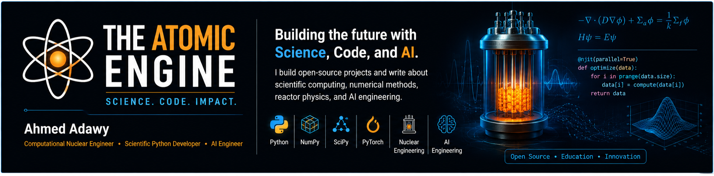

  

<h1 align="center">Hi 👋, I'm Ahmed Adawy</h1>

<h3 align="center">
Computational Nuclear Engineer • Scientific Python • Numerical Methods • AI Engineering
</h3>

Building scientific software, numerical simulations, and practical AI engineering projects.

---

## 🚀 About Me

- 🔬 Computational Nuclear Engineering
- 🐍 Scientific Python Developer
- 🤖 AI Engineering & Transformer Architectures
- 📐 Numerical Methods & Scientific Computing
- ✍️ Technical Author
- 🌱 Passionate about building open-source educational projects

---

## 🛠 Tech Stack

**Languages**
- Python

**Scientific Computing**
- NumPy
- SciPy
- Numba
- PyTorch

**Engineering**
- Numerical Methods
- Monte Carlo
- Reactor Physics
- Scientific Computing
- Software Architecture

---

## 📚 Featured Projects

### 🔹 Python Loop Optimizer
Optimizing Python loops for high-performance scientific computing.

### 🔹 System Architecture Demo
Practical software architecture using Python.

---

## ✍️ Publications

📰 Medium
https://medium.com/@anasahmedadawy

📖 Hashnode
https://hashnode.com/@ai-architecture

🚀 DEV Community
https://dev.to/ahmedadawy625

📚 Leanpub
https://leanpub.com/u/anas-ahmedadawy

📰 Substack
https://adawy2026.substack.com

---

## 🌐 Connect with Me

💼 LinkedIn

https://www.linkedin.com/in/ahmed-adawy-41a4ba321

🐙 GitHub

https://github.com/adawy20262026-oss

---

## 🎯 Current Focus

- Building reactor simulators from scratch
- Scientific Python
- AI Engineering
- Numerical Methods
- Open-source educational projects

---

⭐ Thanks for visiting my profile!
